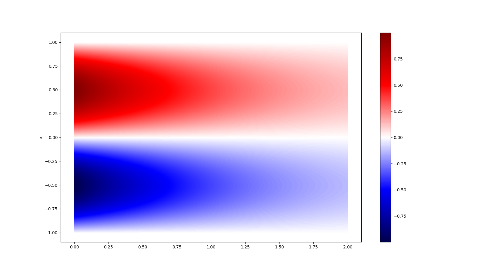

# Physics Informed Neural Network framework for 2D Unsteady Diffusion Equation

We will solve the diffusion equation
$\dfrac{\partial u}{\partial t} = \dfrac{\partial^{2} u}{\partial x^{2}} - e^{-t}(\text{sin}(\pi x) - \pi^{2} \text{sin}(\pi x)) \qquad \qquad x \in [-1, 1], \; t \in [0, 2]$

with initial condition
$u(x, 0) = \text{sin}(\pi x)$

and boundary condition
$u(-1, t) = u(1, t) = 0$

For reference, the exact solution is $u = e^{-t}\text{sin}(\pi x)$. The solution looks like as shown in the figure:

## Using the code
You need to make changes only in the parameter file [Parameter.py](https://github.com/rushikesh-7/PINN-Diffusion/blob/main/Parameters.py). The meaning of each parameter in the file is commented in the file itself.

